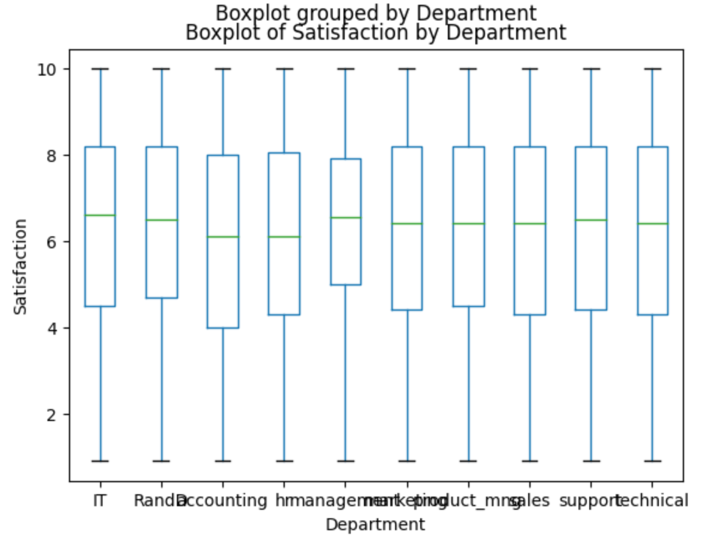

# Playing with Employee Details

This repository contains Python code for analyzing employee HR data using Pandas, NumPy, and Matplotlib. The code addresses specific questions related to employee salaries and presents the results through visualizations.

## Instructions

1. **Install Required Libraries:**
   - Ensure you have the necessary libraries installed:
     ```bash
     pip install pandas numpy matplotlib
     ```

2. **Load the Dataset:**
   - Mount Google Drive and read the CSV file containing employee details.

3. **Run the Code:**
   - Execute the code to obtain answers to the provided questions.

## Results

### Q1: Salary Analysis by Department

- **Sales Department:**
  - Variance: 3,735,138,532.29
  - Standard Deviation: 61,115.78
  - IQR: 49,504.5

- **Product Management Department:**
  - Variance: 3,981,091,028.89
  - Standard Deviation: 63,095.89
  - IQR: 49,403.25

### Q2: Salary Range in IT Department

- Range: 389,930

### Q3: Salary Distribution (Boxplot)



### Q4: Feature with the Highest Standard Deviation

- Feature: Salary_INR
